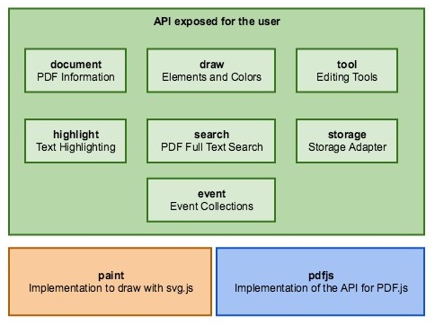
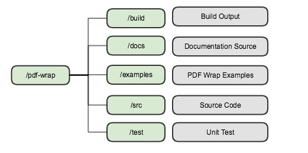
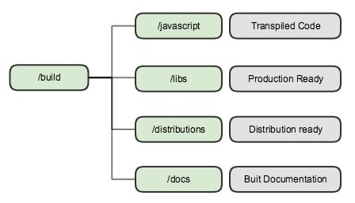

# Development Guide

**Authors**

Nicolas Märchy

**Version 0.0.1**

Copyright &copy; 2018 studer + raimann ag, <a rel="license" href="http://creativecommons.org/licenses/by-sa/4.0/">Creative Commons Attribution-ShareAlike 4.0 International License</a>.

---

# Prerequisites

* Yarn - [https://yarnpkg.com/lang/en](https://yarnpkg.com/lang/en)
* Node.js - [https://nodejs.org/en/](https://nodejs.org/en/)
* MkDocs - [https://www.mkdocs.org/](https://www.mkdocs.org/)
* ghp-import - [https://github.com/davisp/ghp-import](https://github.com/davisp/ghp-import)<br>
You need ghp-import on your PATH, otherwise you won't be able to publish the documentation.

# Architecture



The *API exposed to the user* defines mainly interfaces a user can use. In contrast
to the *paint*, which implements the possibility to draw, is only used internal of PDF Wrap.
The *pdfjs* is the PDF.js implementation for the API.

## Displaying PDF Pages

The PDF pages are displayed by PDF.js. But the highlight as well as the drawing are displayed by PDF Wrap.

Every page is displayed in a specific way.


**HIGHLIGHT LAYER**<br>
This layer contains any text highlighting with a 100% opacity. It is beneath the actual
rendered PDF page, so it won't cover the text.

**PDF Layer**<br>
Is the actual PDF page rendered as svg by PDF.js.

**HIGHLIGHT LAYER TRANSPARENCY**<br>
Is the same as the *HIGHLIGHT Layer* but with less opacity (about 40%). This layer
is required to highlight text which is not on a white background. With only
the *HIGHLIGHT LAYER*, the highlight would not be visible at all, because of the
non-transparent background of the *PDF LAYER*. The transparency is required
to not cover the *PDF LAYER* completely.

**DRAW LAYER**<br>
The layer contains all drawings made by a user.

**TEXT LAYER**<br>
Is the invisible actual text of the PDF page. Is rendered by PDF.js and
enables the text selection, because on the *PDF LAYER* is no text selection
available. Must be invisible, because its only purpose is the text selection.
The text itself may not have the correct font or exact position on the page.

# Directory Structure



**1. /pdf-wrap - Root**

* The PDF Wrap root directory
* Every single file and directory of PDF Wrap
* Directly in this directory are configuration files like `package.json` or `tsconfg.json`

**2. /build - Build Output**

* Contains all generated output files

The `/build` directory has a specific structure itself. Read more about [build directory](#build-directory)

**3. /docs - Documentation Source**

* Contains the documentation's source files

**4. /examples - PDF Wrap Examples**

* Contains examples of how to use PDF Wrap
* Contains a Dev Viewer example mainly used for development

**5. /src - Source Code**

* Contains the source code of PDF Wrap
* This also contains type definition files of libraries which don't have type definitions them-self

**6. /test - Unit Test**

* Contains unit test files
* This also contains files with Mock object of for example interfaces
* Unit Test files must end with `.spec.ts`
* Mock files must end with `.mock.ts`
* Only files ending to `.spec.ts` or `.mock.ts` are picked up by Typescript

## build directory

The `build` directory is the output directory for any file generated through the [Tasks](#tasks).

It is structured in a specific way.



**1. /javascript - Transpiled Code**

* Directly transpiled typescript code from `src` and `test` directory
* No uglifying
* No dependencies

**2. /libs - Production Ready**

* This code is production ready
* Uglified
* With dependencies and additional resources like CSS files

**3. /distributions - Distribution Ready**

* This code is ready to be distributed
* Uglified
* With dependencies and additional resources like CSS files
* With README file
* With CHANGELOG file
* With modified package.json file

# Tasks

PDF Wrap uses [Gulp](https://gulpjs.com/) for its task management.

The `gulpfile.js` uses the `app.properties.js` file to get specific directories.

The `app.properties.js` file just exports an object, which resolves important directory paths absolute.

## build Tasks

The **build** tasks contain tasks all around building the project.

**`clean`**<br>
Cleans the build by removing the `build` directory.

**`build`**<br>
Transpiles and lints typescript and runs the tests.

**`package`**<br>
Packs the project ready to use. Copies resources needed and uglifies the javascript code.

**`repackage`**<br>
Same as `package` but executes `clean` before

**`uglifyJS`**<br>
Uglifies the javascript code

## docs Tasks

The **docs** tasks contain tasks about generating or publishing the documentation.

**`mkdocs`**<br>
Generates the MkDocs documentation and includes the typedoc.

**`typedoc`**<br>
Generates the typedoc api documentation.

**`publishDoc`**<br>
Generates and publishes the MkDocs.

## other Tasks

The **other** tasks contain tasks which have more a general purpose, rather than something specific.

**`copyDependencies`**<br>
Copies the projects dependencies.

**`copyCMaps`**<br>
Copies the cMaps of PDF.js

**`copyPDFJS`**<br>
Copies the PDF.js files needed.

**`copyCSS`**<br>
Copies and concat the CSS files needed.

**`transformPackageJSON`**<br>
Declares every dependency used in package.json as `bundledDependencies`.
This is needed, because PDF Wrap does not come with a bundled js file.
Therefore npm needs to know, that the dependencies are bundled.
In addition, `devDependecies` are cleared, because they are not needed for production.

**`transpileTypescript`**<br>
Transpiles typescript to javascript and generates inline source maps.

## npm Tasks

The **npm** tasks contain tasks used for [npmjs](https://www.npmjs.com/).

**`pack`**<br>
Runs `yarn pack` for the `build/distributions/npm` directory.

**`publish`**<br>
Publishes the project to npm.

## verification Tasks

The **verification** tasks contain tasks about testing.

**`test`**<br>
Runts the unit tests.

**`lint`**<br>
Lints the typescript code.

# Logging

PDF Wrap uses [typescript-logging](https://github.com/mreuvers/typescript-logging).

The configuration abstracted to the user, to enable a unified log output.

## The logger name

The logger name has a specific scheme in order to enable a unified and an exact as possible log output.

`<namespace>/<file-path>:<class-name>`

**`<namespace>`**<br>
The namespace is always the same value: `ch/studerraimann/pdfwrap`

**`<file-path>`**<br>
The path of the file where you create the logger. The file name must be without the extension
and the file path is relative to the `src` directory of PDF Wrap.

**`<class-name>`**<br>
The class or function name where you create the logger.

### Example: Class

Assuming the class is declared in the file `src/services/my-service.ts`.

```typescript
export class MyService {
    
    private readonly log: Logger = LoggerFactory.getLogger("ch/studerraimann/pdfwrap/services/my-service:MyService");
    
    constructor() {
        this.log.info(() => "Call constructor of MyService");
    }
```

### Example: File

Assuming the function is declared in the file `src/services/my-service.ts`.

```typescript
export function doSomething() {
    
    const log: Logger = LoggerFactory.getLogger("ch/studerraimann/pdfwrap/services/my-service:doSomething");
    
    log.info(() => "Call doSomething");
}
```

**You should always use the lambda expression for a log message, because this way it will only be executed when its needed.**

> Please note, that the `Logger` type must be imported from `typescript-logging`,
but the `LoggerFactory` class is from `src/log-config.ts`.

## Why using it this way?

PDF Wrap provides an API to configure the logging output way down to a function or class.
This way, the logger names are unified and as a result the configuration can be applied to every logger.

Read the [Reference Documentation about logging](reference-documentation.md#setup-logger) to understand the concept better. 

# MkDocs

The PDF Wrap documentation is built with [MkDocs](https://www.mkdocs.org/).

The documentation contains the following parts.

**Home**<br>
The index of the documentation. Contains a quick start and link to other parts of the documentation.

**Guides**<br>
Contains guides with a specific example of a specific part of PDF Wrap.

For example: How to implement a Storage Adapter

**Reference Documentation**<br>
Contains the full in-depth documentation about how to use PDF Wrap.

**Development Guide**<br>
Contains guides about the source code and how to develop with PDF Wrap.

## How to publish the documentation

TODO: Write manual


# Unit Testing

PDF Wrap uses [Mocha](https://mochajs.org/) to run its tests. In addition, [chaijs](http://www.chaijs.com/) is used
to assert test results. And for mocking classes, [ts-mockito](https://github.com/NagRock/ts-mockito) is used.

## Where to write tests

All unit tests are declared in the `test` directory. This directory remains
in the same structure like the `src` directory. Test files must end with `.spec.ts` and
any files containing mock classes (if needed) must end with `.mock.ts`.

The file name of a unit test is the same where the class or function you wanna test, is declared.

For Example

`src/pdfjs/my-service.ts` contains a function called `doBar` you wanna test.

`test/pdfjs/my-service.spec.ts` must be the file name of the unit test.

## Test style

Mocha is a BDD (Behaviour Driven Development) testing Framework. Therefore we organize our test like this.

### Testing classes

The unit test structure of a class

```typescript

describe('the class you test', () => {
  
    describe('the method you test', () => {
      
        describe('the case of the method you test', () => {
          
            it('should do what you expect', () => {
                // AAA
            }); 
        });
    });
});
```

This way you have a group per class, per method and per case of a method.

The `it` block should always start with "should".<br>
For example, if you expect an error to be thrown: `it("should throw an error indicating that ...", () => { ... })`

`AAA` stands for `Arrange`, `Act` and `Assert`, which means a test should be structured in that way.

1. Arrange everything for the test like mocks
2. Act, which means that you invoke the method or function you wanna test
3. Assert if everything worked like expected

**Pro Tip:** Mark where your `Arrange` stops and your `Act` starts or where your `Act` stops and your `Assert` starts
with two blank lines between them.

> Sometimes you just can not have this structure. Especially when you test for errors,
because you have to invoke the tested method or function during the assert.
AAA is more a guide line rather than an absolute rule.

### Testing functions

When you test functions its pretty much the same structure, but you leave out the class describe.

```typescript
describe('the function you test', () => {
  
    describe('the case you test', () => {
      
        it('should do what you expect', () => {
            // AAA
        }); 
    });
});
```

## Mocha

Mocha has a cli options file which will be used: `test/mocha.opt`.

This file contains command line arguments which should be used when running mocha.

Read more about [Mocha Options](https://mochajs.org/#mochaopts)

## ts-mockito

ts-mockito is a mocking library for Typescript. A big advantages is, that
you don't lose the type definitions like you would for example with Sinon.js

### Mocking interfaces

Because interfaces are a Typescript only thing and are not available during the runtime,
ts-mockito can not mock interfaces. So you have to create a mock class of the interface
you wanna mock your-self.

Because ts-mockito **can** mock classes, you only have to create a mock class
as an empty implementation, rather than a mock class for each case you wanna test.

#### Example mocking interface

This is our interface

```typescript
export interface MyService {
    
    bar: number;
    
    readonly foo: number;
    
    doBar(): void;
}
```

You create a mock class for it

```typescript
export class MockMyService implements MyService {
    
    get bar(): number {
        throw new Error("Not implemented test stub");
    }
    
    set bar(_: number): void {
        throw new Error("Not implemented test stub");
    }
    
    get foo(): number {
        throw new Error("Not implemented test stub");
    }
    
    doBar(): void {
        throw new Error("Not implemented test stub");
    }
}
```

Please note, that all implementations, including the properties, do throw an `Error`
indicating that this test stub is not implemented. This makes sure you do not
have a side effect when you forgot to manipulate a method or property.

In addition, parameters should be renamed to a `_` symbol, otherwise the Typescript compiler would report an error.

Read more about [Unused Parameters](#unused-parameters)

> Please note, that ts-mockito can mock an abstract class, but only manipulate non-abstract methods.
Therefore, an interface can not be mocked by creating an abstract class of it
and use the abstract class as the mock class.

# Miscellaneous

## CSS

Whenever you have to declare CSS you must add it in the file `src/assets/css/pdf-wrap.css`.

When the project is be built, this file will be concat together with the CSS file
of PDF.js.

## Custom type def

Whenever small type definitions are needed, they can be written in the `src/declarations.ts` file.
But it should not contain too much type defs of the same library.

If that's the case, create a directory in the `src/declarations` directory named after the library
you wanna use and write your type definitions there.

## Unused Parameters

Because our `tsconfig.json` enables the `noUnusedParameter` flag, you would get an error
whenever you don't need a parameter. Instead of just not declare the parameter,
you should rename it with a `_` symbol. This way the Typescript compiler will not report an error
and a developer does know, there is a parameter but it is not used.

In case you have multiple parameters you don't need, just add a additional `_` to the second unused parameter.

Example

```typescript

// unused parameter
doBar(_: number): void { ... }

// two unused parameters
doBar(_: nmuber, __: number): void { ... }

// three unused parameters
doBar(_: number, __: number, ___: number): void { ... }

// two unused with one used parameter
doBar(_: number, usedParameter: number, __: number): void {
    console.log(usedParameter);
}

// and so on
```

This also can be applied to any case where a parameter is unused, whenever its a
lambda expression, a method to implement or even a setter.

## Type Doc

The type doc should be written in most cases. There are exceptions like getters / setters.
In addition to the the description in a type doc, there should be the following type doc annotations:

* `@author your-name <your-email>` - e.g. `@author Max Muster <mm@gmail.com>`
* `@since current-pdfwrap-version` - e.g. `@since 1.0.0`
* `@internal` - is optional and should be declared whenever something is only used intern of PDF Wrap

## PDF.js

PDF Wrap makes a high usage of [PDF.js](https://mozilla.github.io/pdf.js/), which is written in Javascript.

The distribution of PDF.js is only the parsing functionality. But we also use their PDF Viewer.
Because of that, some parts of the PDF.js node module will be copied to the build output.

### Type def

[Definitelytyped](https://definitelytyped.org/) contains a type def for PDF.js, but unfortunately it is not correct.
Therefore we have our own type def of PDF.js, located in `src/declarations/pdfjs`.

**This type def is not complete and contains only what we need right now.**

Whenever you need more of the API of PDF.js, you have to extend the type def.
